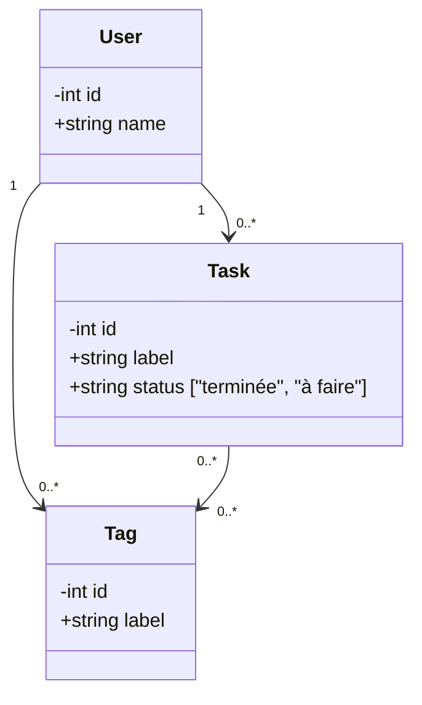

```mermaid
classDiagram
    User "1" --> "0..*" Task 
    User "1" --> "0..*" Tag 
    Task "0..*" --> "0..*" Tag 
    class User{
        -int id
        +string name
    }
    class Task{
        -int id
        +string label
        +string status ["terminée", "à faire"]
    }
    class Tag{
        -int id
        +string label
    }
```